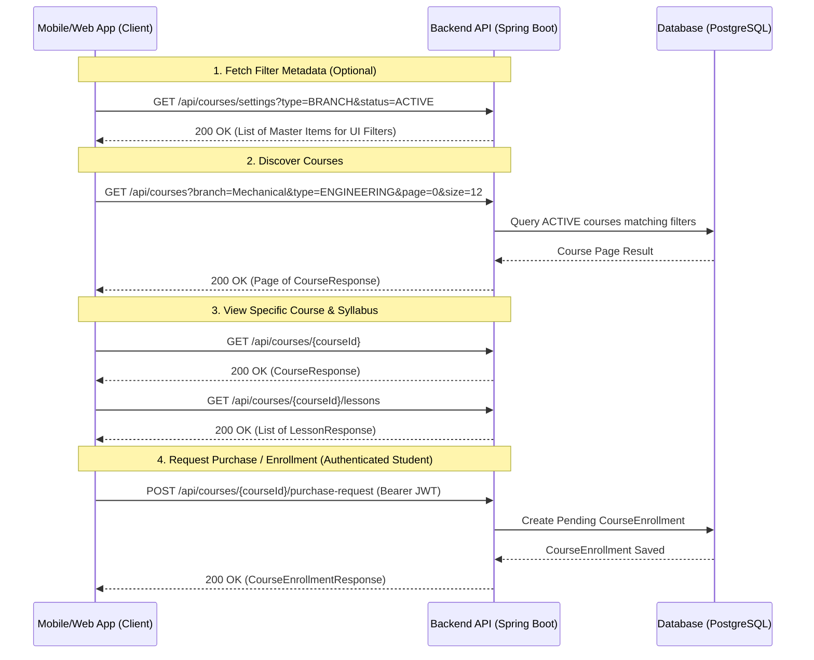

# Student Course Discovery & Integration API Documentation

This document details the APIs and integration guide for client applications (Android, iOS, and Web) for users with the **`STUDENT`** role to discover, filter, view details, and request enrollment for courses.

---

## 1. Overview & Sequence Flow

Students can browse and discover active published courses without requiring an active enrollment. Once logged in as a `STUDENT`, they can also trigger course purchase/enrollment requests.



---

## 2. Authentication & Authorization Headers

* **Public Catalogue Endpoints:**  
  Endpoints `GET /api/courses`, `GET /api/courses/{id}`, and `GET /api/courses/settings` are publicly accessible. Including the `Authorization` header is optional for browsing.
* **Student Action Endpoints:**  
  Endpoints such as `POST /api/courses/{courseId}/purchase-request` require an authenticated student token.

```http
Authorization: Bearer <accessToken>
Content-Type: application/json
```

---

## 3. API Reference

### A. Discover Courses (Paginated)
Fetch active courses added to the system. Supports filtering by branch, university, course type, and academic year.

* **Endpoint:** `GET /api/courses`
* **Access Level:** Public / Authenticated Student
* **Query Parameters:**

| Parameter | Type | Required | Default | Description |
| :--- | :--- | :--- | :--- | :--- |
| `branch` | String | No | — | Filter by branch name (e.g. `Mechanical`, `Computer`) |
| `university` | String | No | — | Filter by university name |
| `type` | String | No | — | Course type: `POLYTECHNIC` or `ENGINEERING` |
| `year` | String | No | — | Filter by academic year label |
| `page` | Integer | No | `0` | Zero-based page number |
| `size` | Integer | No | `12` | Page size (max `50`) |
| `sort` | String | No | `"name"` | Sort field (`"name"`, `"createdAt"`, `"price"`, etc.) |

* **Example Request:**
  `GET /api/courses?type=ENGINEERING&branch=Mechanical&page=0&size=10&sort=name`

* **Success Response (200 OK):**
  ```json
  {
    "content": [
      {
        "id": "3fa85f64-5717-4562-b3fc-2c963f66afa6",
        "name": "Advanced Fluid Mechanics",
        "description": "Comprehensive course on fluid dynamics for engineering students.",
        "type": "ENGINEERING",
        "mode": "REGULAR",
        "price": 4999.00,
        "accessDurationMonths": 12,
        "branches": ["Mechanical Engineering"],
        "branchIds": ["b1a2c3d4-5717-4562-b3fc-2c963f66afa6"],
        "year": "3rd Year",
        "university": "Pune University",
        "startDate": "2026-08-01",
        "endDate": "2027-07-31",
        "thumbnailUrl": "https://r2.pme.com/thumbnails/fluid_mechanics.webp",
        "status": "ACTIVE",
        "studentsCount": 142,
        "completionStatus": "Active",
        "createdAt": "2026-07-20T10:00:00Z",
        "updatedAt": "2026-07-22T12:00:00Z"
      }
    ],
    "pageable": {
      "pageNumber": 0,
      "pageSize": 12
    },
    "totalElements": 1,
    "totalPages": 1,
    "last": true,
    "size": 12,
    "number": 0
  }
  ```

---

### B. Get Single Course Details
Fetch detailed information for a specific active course.

* **Endpoint:** `GET /api/courses/{id}`
* **Access Level:** Public / Authenticated Student
* **Path Variables:** `id` (UUID)
* **Success Response (200 OK):**
  ```json
  {
    "id": "3fa85f64-5717-4562-b3fc-2c963f66afa6",
    "name": "Advanced Fluid Mechanics",
    "description": "Comprehensive course on fluid dynamics for engineering students.",
    "type": "ENGINEERING",
    "mode": "REGULAR",
    "price": 4999.00,
    "accessDurationMonths": 12,
    "branches": ["Mechanical Engineering"],
    "branchIds": ["b1a2c3d4-5717-4562-b3fc-2c963f66afa6"],
    "year": "3rd Year",
    "university": "Pune University",
    "thumbnailUrl": "https://r2.pme.com/thumbnails/fluid_mechanics.webp",
    "status": "ACTIVE",
    "studentsCount": 142,
    "completionStatus": "Active",
    "createdAt": "2026-07-20T10:00:00Z",
    "updatedAt": "2026-07-22T12:00:00Z"
  }
  ```
* **Error Response (404 Not Found):**
  Returned if the course ID does not exist or if the course status is `HIDDEN`.

---

### C. Get Master Items for UI Filters
Fetch available categories, branches, academic years, and universities to populate filter dropdowns in the mobile app.

* **Endpoint:** `GET /api/courses/settings`
* **Access Level:** Public / Authenticated Student
* **Query Parameters:**

| Parameter | Type | Required | Description |
| :--- | :--- | :--- | :--- |
| `type` | String | No | Filter by item type (e.g. `BRANCH`, `YEAR`, `UNIVERSITY`) |
| `status` | String | No | Filter status (e.g. `ACTIVE`) |

* **Example Request:**
  `GET /api/courses/settings?status=ACTIVE`

* **Success Response (200 OK):**
  ```json
  [
    {
      "id": "b1a2c3d4-5717-4562-b3fc-2c963f66afa6",
      "type": "BRANCH",
      "name": "Mechanical Engineering",
      "code": "MECH",
      "status": "ACTIVE",
      "createdAt": "2026-07-01T08:00:00Z"
    },
    {
      "id": "c2b3a4d5-5717-4562-b3fc-2c963f66afa7",
      "type": "YEAR",
      "name": "3rd Year",
      "code": "Y3",
      "status": "ACTIVE",
      "createdAt": "2026-07-01T08:00:00Z"
    }
  ]
  ```

---

### D. Get Course Lessons (Syllabus)
Fetch lessons and curriculum modules belonging to a specific course.

* **Endpoint:** `GET /api/courses/{courseId}/lessons`
* **Access Level:** Public / Authenticated Student
* **Path Variables:** `courseId` (UUID)
* **Success Response (200 OK):**
  ```json
  [
    {
      "id": "e5f6g7h8-5717-4562-b3fc-2c963f66afa8",
      "courseId": "3fa85f64-5717-4562-b3fc-2c963f66afa6",
      "title": "Module 1: Fundamentals of Fluid Kinematics",
      "lessonIndex": 1,
      "status": "ACTIVE",
      "createdAt": "2026-07-21T09:00:00Z",
      "updatedAt": "2026-07-21T09:00:00Z"
    },
    {
      "id": "f6g7h8i9-5717-4562-b3fc-2c963f66afa9",
      "courseId": "3fa85f64-5717-4562-b3fc-2c963f66afa6",
      "title": "Module 2: Bernoulli's Equation & Applications",
      "lessonIndex": 2,
      "status": "ACTIVE",
      "createdAt": "2026-07-21T09:30:00Z",
      "updatedAt": "2026-07-21T09:30:00Z"
    }
  ]
  ```

---

### E. Submit Purchase Request
Submit a request to enroll in or purchase a course as a logged-in student.

* **Endpoint:** `POST /api/courses/{courseId}/purchase-request`
* **Access Level:** Authenticated Student (`ROLE_STUDENT` with valid JWT Token)
* **Path Variables:** `courseId` (UUID)
* **Headers:**
  ```http
  Authorization: Bearer <accessToken>
  ```
* **Success Response (200 OK):**
  ```json
  {
    "id": "71a85f64-5717-4562-b3fc-2c963f66af10",
    "studentName": "John Doe",
    "mobileNumber": "9876543210",
    "courseName": "Advanced Fluid Mechanics",
    "requestDate": "2026-07-25 11:30:00",
    "paymentType": "FULL",
    "installmentsCount": 1,
    "paymentStatus": "PENDING",
    "accessStatus": "Pending",
    "accessStartDate": null,
    "accessEndDate": null,
    "finalPrice": 4999.00,
    "promoCodeUsed": null,
    "discountAmount": 0.00,
    "paymentMethod": "ONLINE",
  }
  ```

---

### F. Cancel Purchase Request
Cancel a pending purchase request for a course as a logged-in student.

* **Endpoint:** `POST /api/courses/{courseId}/cancel-request`
* **Access Level:** Authenticated Student (`ROLE_STUDENT` with valid JWT Token)
* **Path Variables:** `courseId` (UUID)
* **Headers:**
  ```http
  Authorization: Bearer <accessToken>
  ```
* **Success Response (200 OK):**
  ```json
  {
    "id": "71a85f64-5717-4562-b3fc-2c963f66af10",
    "studentName": "John Doe",
    "mobileNumber": "9876543210",
    "courseName": "Advanced Fluid Mechanics",
    "requestDate": "2026-07-25 11:30:00",
    "paymentType": "FULL",
    "installmentsCount": 1,
    "paymentStatus": "CANCELLED",
    "accessStatus": "Cancelled",
    "accessStartDate": null,
    "accessEndDate": null,
    "finalPrice": 4999.00,
    "promoCodeUsed": null,
    "discountAmount": 0.00,
    "paymentMethod": "ONLINE",
    "transactionRefId": "REQ-20260725-9812",
    "installmentPlan": []
  }
  ```

---

### G. Get Enrolled Courses ("My Courses")
Fetch all approved/granted courses belonging to the logged-in student.

* **Endpoint:** `GET /api/courses/my-courses`
* **Access Level:** Authenticated Student (`ROLE_STUDENT` with valid JWT Token)
* **Headers:**
  ```http
  Authorization: Bearer <accessToken>
  ```
* **Success Response (200 OK):**
  ```json
  [
    {
      "id": "3fa85f64-5717-4562-b3fc-2c963f66afa6",
      "name": "Advanced Fluid Mechanics",
      "description": "Comprehensive course on fluid dynamics for engineering students.",
      "type": "ENGINEERING",
      "mode": "LIVE",
      "price": 4999.00,
      "accessDurationMonths": 12,
      "branches": ["Mechanical Engineering"],
      "year": "3rd Year",
      "university": "SPPU",
      "startDate": "2026-08-01",
      "endDate": "2027-07-31",
      "thumbnailUrl": "https://r2.pme.com/thumbnails/fluid_mechanics.webp",
      "status": "ACTIVE"
    }
  ]
  ```

---

## 4. Enums Reference

### CourseType
* `POLYTECHNIC` — Diploma / Polytechnic courses
* `ENGINEERING` — Degree / Bachelor of Engineering courses

### CourseMode
* `LIVE` — Live interactive classes
* `RECORDED` — Pre-recorded video sessions
* `BOTH` — Combination of live interactive classes and pre-recorded videos

### CourseStatus
* `ACTIVE` — Published and discoverable by students
* `HIDDEN` — Drafted or hidden from public catalogue (visible only to Admins)

---

## 5. Client Integration Best Practices (Android & iOS)

1. **Infinite Scroll / Pagination:**  
   Use the `page` and `size` parameters from `GET /api/courses` to implement smooth pagination or infinite scroll on mobile devices.
2. **Filter Caching:**  
   Cache results of `GET /api/courses/settings` locally on client launch to build filter chips (Branch, University, Year) without making repeated network calls.
3. **Empty States & Pricing:**  
   If `price` is `null` or `0.00`, display **"FREE"** on the course card UI. If `accessDurationMonths` is `null`, display **"Lifetime Access"**.
4. **Thumbnail Handling:**  
   Load `thumbnailUrl` asynchronously using image loading libraries (e.g. Glide/Coil for Android, Kingfisher/Nuke for iOS). Fall back to a default course placeholder banner if `thumbnailUrl` is null.
