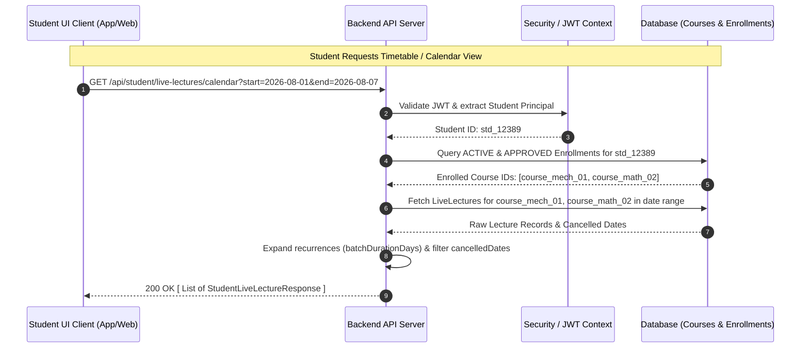

# Scheduled Live Lectures API & Security Documentation (UI Client)

This document provides complete, security-enforced API specifications for UI client developers (Flutter / Mobile / Web) to integrate **Scheduled Live Lectures**.

It explicitly covers security rules, endpoint contracts, authorization models, calendar expansion logic, and client-side integration guidelines to ensure that **students can ONLY view scheduled live lectures for their actively enrolled subjects/courses**.

---

## 1. Security Architecture & Enrollment Isolation

To guarantee security and privacy, access control for live lectures is enforced on **both the API route layer and the data query level**:

1. **JWT Authentication Requirement:**
   - Every request from the UI student client MUST send an `Authorization: Bearer <token>` header containing a valid JWT.
2. **Server-Side Access Control (Zero Trust on Client):**
   - The UI client **must not filter endpoints locally based on raw course IDs alone**.
   - The backend validates active course enrollment (`accessStatus == APPROVED` / `ACTIVE` and current date within `[accessStartDate, accessEndDate]`).
   - Requests to access live lectures of non-enrolled or expired courses will return `403 Forbidden` or `404 Not Found`.
3. **Meeting URL Protection:**
   - `meetingUrl` (e.g. Zoom/Google Meet/Custom WebRTC links) is stripped or masked for non-enrolled students.
   - For enrolled students, `meetingUrl` is accessible **only** during active access windows.

---

## 2. Sequence Diagram



---

## 3. Endpoints Reference

### A. Fetch Enrolled Student's Live Lecture Calendar (Timetable)
Fetches all scheduled live lectures occurring within a specified date range across **all courses/subjects in which the student is currently enrolled**.

* **Endpoint:** `GET /api/student/live-lectures/calendar`
* **Access Control:** `ROLE_STUDENT` (Requires valid Bearer Token)
* **Query Parameters:**

| Parameter | Type | Required | Example | Description |
| :--- | :--- | :--- | :--- | :--- |
| `start` | String (ISO Date) | Yes | `2026-08-01` | Start date of window (inclusive) |
| `end` | String (ISO Date) | Yes | `2026-08-31` | End date of window (inclusive) |
| `courseId` | String (UUID) | No | `3fa85f64-...` | Optional filter for a specific enrolled subject |

* **Headers:**
  ```http
  Authorization: Bearer <student_jwt_token>
  Accept: application/json
  ```

* **Response (200 OK):**
  ```json
  [
    {
      "id": "7b89f641-8912-4a62-b3fc-2c963f66af10",
      "courseId": "3fa85f64-5717-4562-b3fc-2c963f66afa6",
      "courseName": "Advanced Fluid Mechanics",
      "subjectCode": "MECH-301",
      "title": "Unit 3: Navier-Stokes Equations Live Discussion",
      "date": "2026-08-03",
      "time": "10:30:00",
      "lectureType": "NORMAL",
      "batchDurationDays": 5,
      "meetingUrl": "https://meet.pme.com/room/fluid-mech-live-301",
      "cancelledDates": [
        "2026-08-05"
      ],
      "isCancelledForDate": false,
      "enrollmentValidUntil": "2027-07-31"
    },
    {
      "id": "9c12a452-1102-4c62-a3ff-1c963f66bf22",
      "courseId": "1a2b3c4d-5717-4562-b3fc-2c963f66afa7",
      "courseName": "Applied Mathematics III",
      "subjectCode": "MATH-302",
      "title": "Batch Workshop - Fourier Transforms",
      "date": "2026-08-04",
      "time": "14:00:00",
      "lectureType": "BATCH",
      "batchDurationDays": 3,
      "meetingUrl": "https://meet.pme.com/room/math-fourier-workshop",
      "cancelledDates": [],
      "isCancelledForDate": false,
      "enrollmentValidUntil": "2027-01-15"
    }
  ]
  ```

* **Error Responses:**
  - `401 Unauthorized`: Token is missing, expired, or invalid.
  - `403 Forbidden`: Authenticated user is not a `STUDENT` or access is revoked.

---

### B. Fetch Live Lectures for a Specific Enrolled Subject / Course
Fetches the complete schedule of live lectures for a single course, subject to active student enrollment verification.

* **Endpoint:** `GET /api/student/courses/{courseId}/live-lectures`
* **Access Control:** `ROLE_STUDENT` (Requires valid Bearer Token)
* **Path Parameters:**
  - `courseId` (UUID): The ID of the course/subject.

* **Headers:**
  ```http
  Authorization: Bearer <student_jwt_token>
  ```

* **Response (200 OK):**
  ```json
  [
    {
      "id": "7b89f641-8912-4a62-b3fc-2c963f66af10",
      "courseId": "3fa85f64-5717-4562-b3fc-2c963f66afa6",
      "courseName": "Advanced Fluid Mechanics",
      "title": "Unit 3: Navier-Stokes Equations Live Discussion",
      "date": "2026-08-03",
      "time": "10:30:00",
      "lectureType": "NORMAL",
      "batchDurationDays": 5,
      "meetingUrl": "https://meet.pme.com/room/fluid-mech-live-301",
      "cancelledDates": ["2026-08-05"]
    }
  ]
  ```

* **Error Responses:**
  - `403 Forbidden`: Returned if the student is **not enrolled** in the requested `courseId` or their enrollment has expired.
  - `404 Not Found`: Course does not exist.

---

## 4. UI Client Data Models (Dart / TypeScript Reference)

### A. Data Schema / DTO Definition

```typescript
export enum LiveLectureType {
  NORMAL = "NORMAL",
  BATCH = "BATCH"
}

export interface StudentLiveLecture {
  id: string;                  // UUID
  courseId: string;            // UUID
  courseName: string;          // e.g. "Advanced Fluid Mechanics"
  subjectCode?: string;        // e.g. "MECH-301"
  title: string;               // Lecture Title
  date: string;                // Start Date (YYYY-MM-DD)
  time: string;                // Time (HH:mm:ss)
  lectureType: LiveLectureType;// NORMAL | BATCH
  batchDurationDays: number;   // Consecutive days if BATCH lecture
  meetingUrl: string;          // Valid meeting link
  cancelledDates: string[];    // Array of cancelled ISO dates ["YYYY-MM-DD"]
}
```

---

## 5. Daily Expansion Logic for UI Timetable Rendering

When rendering a daily or weekly timetable screen in the UI (e.g. `TimetableScreen`), the UI MUST compute occurrence dates for batch/recurring lectures and ignore explicitly cancelled dates.

### Algorithm (Client-Side Rendering):

```dart
List<DailyLectureOccurrence> getLecturesForDate(
  DateTime selectedDate, 
  List<StudentLiveLecture> lectures
) {
  final List<DailyLectureOccurrence> result = [];

  for (final lecture in lectures) {
    final DateTime startDate = DateTime.parse(lecture.date);
    final DateTime endDate = startDate.add(Duration(days: lecture.batchDurationDays - 1));
    final String dateString = selectedDate.toIso8601String().substring(0, 10);

    // 1. Check date range bounds
    if (selectedDate.isBefore(startDate) || selectedDate.isAfter(endDate)) {
      continue;
    }

    // 2. Check if date is in cancelledDates array
    if (lecture.cancelledDates.contains(dateString)) {
      continue; // Skip rendering cancelled lecture instance
    }

    // 3. Add to daily list
    result.add(DailyLectureOccurrence(
      lectureId: lecture.id,
      courseId: lecture.courseId,
      courseName: lecture.courseName,
      title: lecture.title,
      time: lecture.time,
      meetingUrl: lecture.meetingUrl,
      isBatch: lecture.batchDurationDays > 1,
    ));
  }

  return result;
}
```

---

## 6. Security Checklist for UI Implementation

- [x] **No Hardcoded/Bypassed Auth:** Always attach `Authorization: Bearer <token>` from secure storage (e.g. `FlutterSecureStorage` or EncryptedSharedPreferences).
- [x] **Handle 403 Forbidden Gracefully:** If `403` is returned on fetching lecture details, prompt the user with an "Enrollment Required or Expired" UI banner and hide the join/meeting button.
- [x] **Meeting URL Protection:** Do not reveal or display `meetingUrl` prior to 15 minutes before the scheduled `time`.
- [x] **Automatic Session Refresh:** If JWT expires, refresh the token silently via auth interceptor before fetching timetable items.
